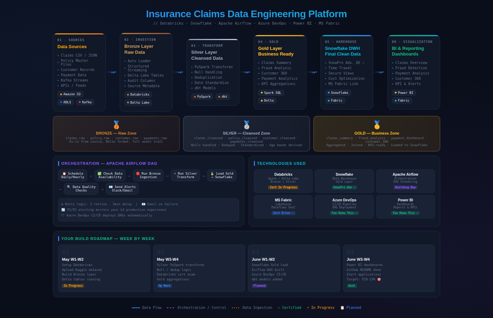
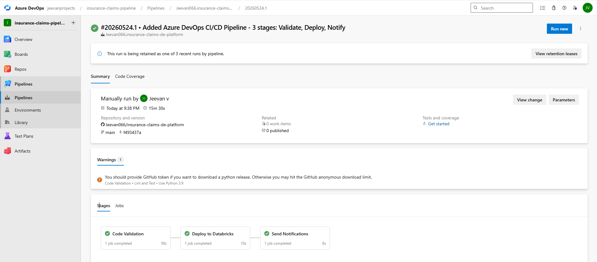
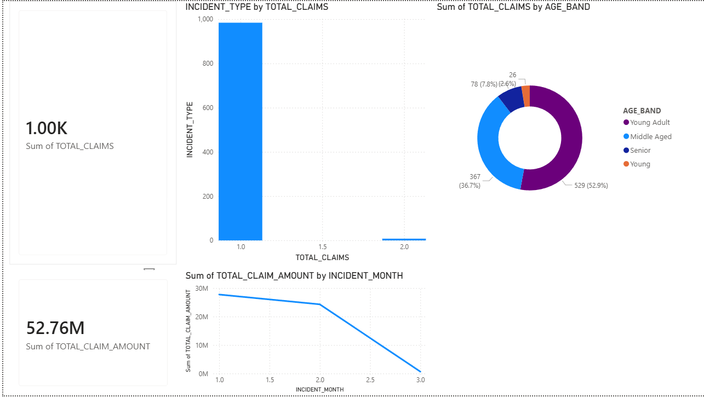
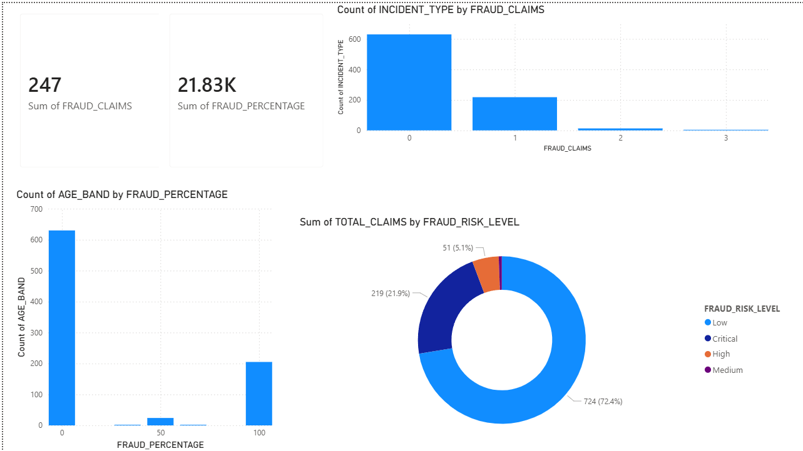

# 🏥 Insurance Claims Data Engineering Platform

[](https://dev.azure.com)
[](https://databricks.com)
[](https://snowflake.com)
[](https://airflow.apache.org)
[](https://powerbi.microsoft.com)

---

## 📌 Project Overview

An end-to-end Data Engineering pipeline that processes raw insurance claims data through a **Medallion Architecture** (Bronze → Silver → Gold), loads business-ready data into **Snowflake**, orchestrates the pipeline via **Apache Airflow**, automates deployment through **Azure DevOps CI/CD**, and delivers insights via **Power BI dashboards**.

> Inspired by real-world UK insurance domain experience supporting production data pipelines for a BFSI client.

---

## 🏗️ Architecture



---

## 🛠️ Tech Stack

| Layer | Technology |
|-------|-----------|
| Data Processing | Apache Spark, PySpark, Databricks |
| Storage | Delta Lake, Snowflake |
| Orchestration | Apache Airflow |
| CI/CD | Azure DevOps |
| BI & Reporting | Power BI |
| Version Control | GitHub |
| Cloud | Microsoft Azure |

---

## 📊 Pipeline Flow

```
Raw CSV Data (Insurance Claims)
        ↓
🥉 BRONZE LAYER — Databricks Auto Loader
   Raw Delta tables with audit columns
        ↓
🥈 SILVER LAYER — PySpark Transformations
   Cleansed, deduplicated, enriched data
        ↓
🥇 GOLD LAYER — Business Aggregations
   Claims summary, Fraud analysis, Customer 360
        ↓
❄️ SNOWFLAKE — Data Warehouse
   Final clean data for reporting
        ↓
📊 POWER BI — Dashboards
   Claims Overview, Fraud Analysis, Customer 360
```

---

## 📁 Project Structure

```
insurance-claims-de-platform/
│
├── ingestion/
│   └── 01_bronze_ingestion.ipynb
│
├── transformation/
│   ├── 02_silver_transformation.ipynb
│   ├── 03_gold_aggregations.ipynb
│   └── 04_load_to_snowflake.ipynb
│
├── airflow/
│   └── insurance_claims_dag.py
│
├── snowflake/
│   └── load_to_snowflake.sql
│
├── powerbi/
│   ├── insurance_claims_dashboard.pbix
│   ├── page1_claims_overview.png
│   ├── page2_fraud_analysis.png
│   └── page3_customer_360.png
│
├── docs/
│   ├── architecture_diagram.png
│   └── azure_devops_pipeline_success.png
│
├── azure-pipelines.yml
└── README.md
```

---

## 🥉 Bronze Layer

**Notebook:** `ingestion/01_bronze_ingestion.ipynb`

- Ingests raw insurance claims CSV using Spark
- Adds audit columns — ingestion timestamp, source file, layer
- Writes to Delta table — `workspace.insurance_claims.bronze_claims_raw`
- 1000 records, 42 columns

```python
df_bronze = df_raw \
    .withColumn("ingestion_timestamp", current_timestamp()) \
    .withColumn("source_file", lit("fraud_insurance_claims.csv")) \
    .withColumn("layer", lit("bronze"))

df_bronze.write \
    .format("delta") \
    .mode("overwrite") \
    .saveAsTable("workspace.insurance_claims.bronze_claims_raw")
```

---

## 🥈 Silver Layer

**Notebook:** `transformation/02_silver_transformation.ipynb`

- Reads from Bronze Delta table
- Handles nulls and duplicates — zero found
- Standardizes date formats to yyyy-MM-dd
- Derives age bands — Young, Young Adult, Middle Aged, Senior
- Adds claim severity bands — Low, Medium, High, Critical
- Converts fraud flag Y/N to integer 1/0
- Calculates policy age in days
- 1000 records, 45 columns written to Silver Delta table

```python
df_silver = df_bronze \
    .withColumn("incident_date_clean",
        to_date(col("incident_date"), "yyyy-MM-dd")) \
    .withColumn("age_band",
        when(col("age") < 25, "Young")
        .when(col("age") < 40, "Young Adult")
        .when(col("age") < 55, "Middle Aged")
        .otherwise("Senior")) \
    .withColumn("is_fraud",
        when(col("fraud_reported") == "Y", 1)
        .otherwise(0))
```

---

## 🥇 Gold Layer

**Notebook:** `transformation/03_gold_aggregations.ipynb`

| Table | Description | Rows |
|-------|-------------|------|
| `gold_claims_summary` | Monthly claims aggregations by type, severity, age band | 992 |
| `gold_fraud_analysis` | Fraud patterns by incident type, region, age band | 862 |
| `gold_customer_360` | Complete customer view with loyalty and risk bands | 1000 |

---

## ❄️ Snowflake

**Script:** `snowflake/load_to_snowflake.sql`

- Database: `INSURANCE_DW`
- Schema: `GOLD`
- Warehouse: `INSURANCE_WH` — X-Small, auto-suspend 60 seconds
- Connected via Python Snowflake connector
- Pandas bridge used for Community Edition compatibility

```sql
CREATE DATABASE IF NOT EXISTS INSURANCE_DW;
CREATE SCHEMA IF NOT EXISTS INSURANCE_DW.GOLD;
CREATE WAREHOUSE IF NOT EXISTS INSURANCE_WH
    WAREHOUSE_SIZE = 'X-SMALL'
    AUTO_SUSPEND = 60
    AUTO_RESUME = TRUE;
```

---

## 🔄 Airflow Orchestration

**DAG:** `airflow/insurance_claims_dag.py`

- Schedule: Daily 6:00 AM
- Retries: 3 attempts with 5 minute delay
- 7 tasks running sequentially

```
check_data_availability
        ↓
bronze_ingestion
        ↓
silver_transformation
        ↓
gold_aggregations
        ↓
load_to_snowflake
        ↓
data_quality_checks
        ↓
send_success_notification ✅
```


---

## 🚀 Azure DevOps CI/CD

**Pipeline:** `azure-pipelines.yml`

- Trigger: Every push to main branch
- 3 stages running sequentially

| Stage | Description | Status |
|-------|-------------|--------|
| Code Validation | Install dependencies, validate notebooks, run tests | ✅ |
| Deploy to Databricks | Install CLI, deploy notebooks, trigger jobs | ✅ |
| Send Notifications | Success email notification | ✅ |



---

## 📊 Power BI Dashboards

Connected to Snowflake Gold layer via Import mode.

### Page 1 — Claims Overview


- Total Claims: 1,000
- Total Payout: $52.76M
- Claims by Incident Type
- Claims by Month trend
- Claims by Age Band

### Page 2 — Fraud Analysis


- Fraud Risk Level distribution
- Fraud by Incident Type
- Fraud percentage by Age Band
- Critical fraud cases highlighted

### Page 3 — Customer 360


- Customer Loyalty Band breakdown
- Risk Level distribution
- Lifetime claims by Occupation
- Average claim by Age Band

---

## 🔑 Key Findings

| Metric | Value |
|--------|-------|
| Total Claims | 1,000 |
| Total Payout | $52.76M |
| Critical Fraud Risk | 21.9% |
| Low Risk Customers | 75.3% |
| Platinum Loyalty | 17.1% |
| Zero Data Quality Issues | ✅ |

---

## 📋 Data Quality Results

| Check | Result |
|-------|--------|
| Null values | ✅ Zero nulls found |
| Duplicate records | ✅ Zero duplicates |
| Schema validation | ✅ All columns verified |
| Row count Bronze | ✅ 1000 records |
| Row count Silver | ✅ 1000 records |
| Row count Gold | ✅ All tables verified |

---

## 🗂️ Dataset

- Source: Kaggle — Insurance Claims Fraud Detection
- Records: 1,000 insurance claims
- Columns: 39 original + 6 derived
- Domain: US Auto Insurance Claims
- Fraud flag: Y/N — 24.7% fraud rate

---

## 🎓 Certifications

| Certification | Status |
|--------------|--------|
| Snowflake SnowPro Core | ✅ Achieved 2025 |
| Snowflake SnowPro Advanced: Data Engineering | ✅ Achieved 2025 |
| Microsoft Azure Fundamentals AZ-900 | ✅ Achieved 2023 |
| Databricks Data Engineer Associate | 🔄 In Progress |
| Microsoft Fabric Analytics Engineer DP-700 | 🔄 In Progress |
| Generative AI Advanced + Honors | ✅ Achieved 2024 |

---

## 🏆 How to Run This Project

### Prerequisites
```
Databricks Community Edition account
Snowflake trial account
Apache Airflow via Docker
Power BI Desktop
Python 3.9+
```

### Steps
```
1. Clone this repository
   git clone https://github.com/Jeevan066/insurance-claims-de-platform.git

2. Download dataset from Kaggle
   Insurance Claims Fraud Detection

3. Upload CSV to Databricks Volume
   workspace.insurance_claims.raw_data

4. Run notebooks in order
   01_bronze_ingestion.ipynb
   02_silver_transformation.ipynb
   03_gold_aggregations.ipynb
   04_load_to_snowflake.ipynb

5. Set up Snowflake
   Run snowflake/load_to_snowflake.sql

6. Start Airflow
   cd airflow-insurance
   docker-compose up -d

7. Trigger DAG
   localhost:8080
   insurance_claims_pipeline

8. Open Power BI
   Connect to Snowflake INSURANCE_DW.GOLD
   Open insurance_claims_dashboard.pbix
```

---

## 👨‍💻 Author

**Jeevan V**
Data Engineer | SnowPro Advanced DE | Databricks | Microsoft Fabric

- 🔗 LinkedIn: [linkedin.com/in/jeevan-v-a916a324a](https://www.linkedin.com/in/jeevan-v-a916a324a)
- 🐙 GitHub: [github.com/Jeevan066](https://github.com/Jeevan066)
- 📧 Email: jeevanvenkatesh62@gmail.com
- 📍 Bengaluru, India

---

*Built with real BFSI domain experience from 2.5+ years supporting UK insurance production pipelines.*
